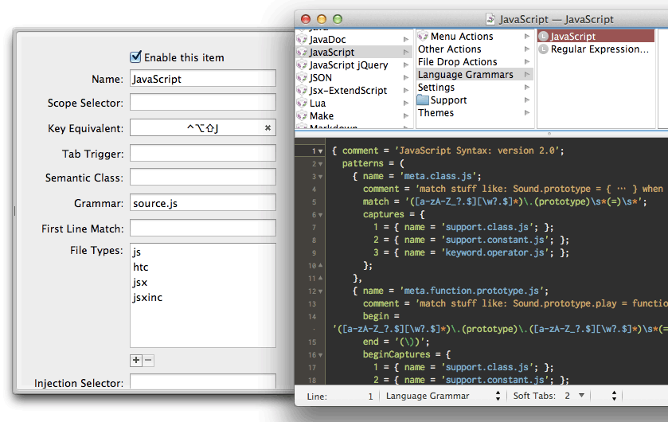

# Jsx.tmbundle

For use with [Adobe.jsx(ExtendScript)](http://www.adobe.com/devnet/scripting.html) CS3 or later.

[Original(kanemu/extendscript.tmbundle)](https://github.com/kanemu/extendscript.tmbundle)

## Install

**Git for TextMate1.5.x**

    $ git clone https://github.com/milligramme/Jsx.tmbundle.git ~/Library/Application\ Support/TextMate/Bundles/Jsx.tmbundle

**Git for TextMate2.x**

    $ git clone https://github.com/milligramme/Jsx.tmbundle.git ~/Library/Application\ Support/Avian/Bundles/Jsx.tmbundle

**Download Zip**

1. [Download the zip](https://github.com/milligramme/Jsx.tmbundle/zipball/master)
1. Unzip.
1. Rename unzipped folder to "Jsx.tmbundle".
1. Open Jsx.tmbundle with TextMate 1.5 or 2.
1. The bundle installs to following paths.
    * ~/Library/Application\ Support/TextMate/Pristine\ Copy/Bundles/Jsx.tmbundle
    * ~/Library/Application\ Support/Avian/Pristine\ Copy/Bundles/Jsx.tmbundle

## Usage

This bundle depend on JavaScript.tmbundle.

To execute .jsx and .jsxinc add File Types : 'jsx jsxinc'. 

**Execute**

* Execute in CS3.app   = control + 3 
* Execute in CS4.app   = control + 4 
* Execute in CS5.app   = control + 5 
* Execute in CS5.5.app = control + shift + 5
* Execute in CS6.app   = control + 6 

By Default run with InDesign, this can be changed using `#target`

     #target "indesign"
     #target "indesign-7.0"
     #target "illustrator"
     #target "photoshop"
     
Can use relative path to `#include` scripts, like below
     
     #include "underscore.js"
     #include "./underscore.js"
     
**Open in ExtensScript Toolkit**

* Open in Estk2      = control + option + 3
* Open in Estk CS4   = control + option + 4
* Open in Estk CS5   = control + option + 5
* Open in Estk CS5.5 = control + option + shift + 5
* Open in Estk CS6   = control + option + 6

